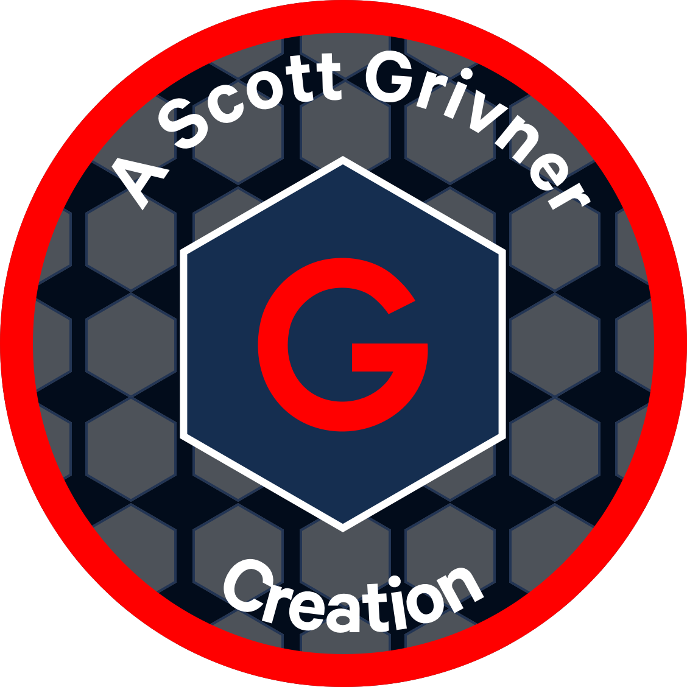

<!-- Begin README -->

    

 

    
     
    
    
    
     
    

---------------

<h1 align="center">Python JSON Parser</h1>

A simple Python script to parse a `JSON` file and output the results to a text file.

---------------

## Table of Contents

- [Background Story](#background-story)
- [Getting Started](#getting-started)
- [Resources](#resources)
- [License](#license)
- [Credits](#credits)

## Background Story

I wanted to parse out a GitHub API response consisting of all of my repositories. The problem is, there are too many `JSON` elements to parse out manually. I needed a way to parse out specific the `JSON` elements values only, automatically. So I built this!

## Getting Started

1. Clone this repository.
2. Install [Python](https://www.python.org/downloads/).
3. Install [Pip](https://pip.pypa.io/en/stable/installing/).
4. Place your `JSON` file in the root directory of this repository (see `example.json`).
5. Adjust the script to parse out the `JSON` elements you want (see `json_parser.py` - lines 7-9 currently set to parse out the first instance of "name").
4. Run the script: `python json_parser.py`
5. View the output in the `output.txt` file.

## Resources

- [Python](https://www.python.org)
- [Pip](https://pip.pypa.io/en/stable/installing/)
- [JSON](https://www.json.org/json-en.html)

## License

This project is released under the terms of **The Unlicense**, which allows you to use, modify, and distribute the code as you see fit. 
- [The Unlicense](https://choosealicense.com/licenses/unlicense/) removes traditional copyright restrictions, giving you the freedom to use the code in any way you choose.
- For more details, see the [LICENSE](LICENSE) file in this repository.

## Credits

**Author:** [Scott Grivner](https://github.com/scottgriv)  
**Email:** [scott.grivner@gmail.com](mailto:scott.grivner@gmail.com)  
**Website:** [scottgrivner.dev](https://www.scottgrivner.dev)  
**Reference:** [Main Branch](https://github.com/scottgriv/python-json_parser)  

---------------

    

<!-- End README -->
